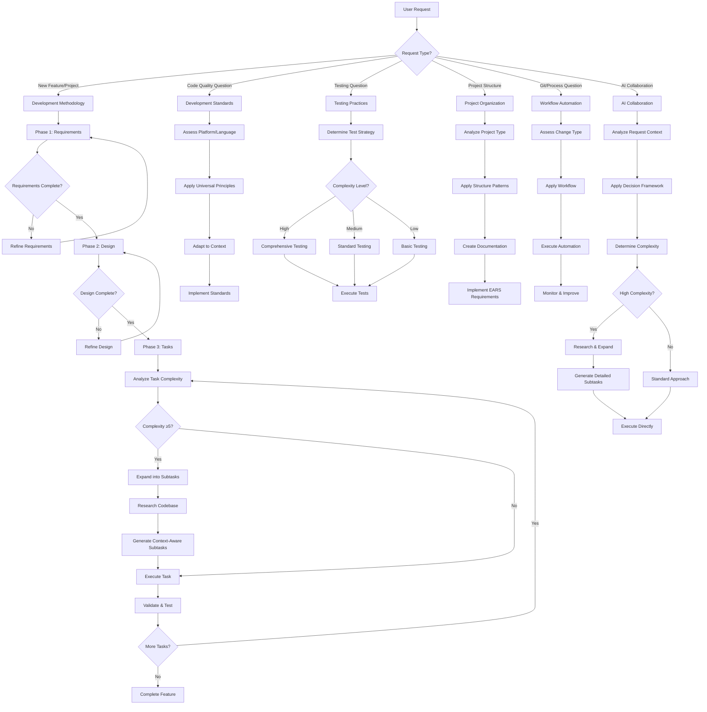

# AI Development Rules - Complete Comprehensive System

## Overview
This folder contains the complete, optimized AI development rule system designed for cross-platform development (mobile apps, web apps, desktop apps, APIs, etc.). These files replace 18+ original files while preserving all valuable content and adding advanced task management capabilities.

## Universal Design Principles
- **Language Agnostic**: Principles apply to any programming language or platform
- **Platform Independent**: Works for mobile, web, desktop, backend, etc.
- **Technology Neutral**: Focuses on universal best practices
- **Scalable**: Adapts from simple scripts to enterprise applications

## Rule Files (Load Order)
1. **development-methodology.mdc** - Core three-phase methodology, communication style, and task complexity management
2. **ai-collaboration.mdc** - Decision frameworks, prompting strategies, complexity analysis, and research integration
3. **development-standards.mdc** - Universal code quality, performance, security principles
4. **project-organization.mdc** - Project structure, documentation, EARS requirements
5. **project-flow-example.mdc** - Complete A-Z workflow from initial chat to finished product

## Master Workflow Decision Tree



## Communication Style (Always Apply)

### Core Philosophy: Listen → Understand → Act
- **Direct Execution**: Jump straight to creating deliverables that demonstrate understanding
- **Strategic Validation**: Simple approval questions at key decision points only
- **No Verbose Explanations**: Show understanding through action, not words
- **Efficient Collaboration**: Minimize back-and-forth while ensuring alignment

### Response Patterns
```
User: "I need X feature"
AI: [Immediately creates requirements.md with comprehensive EARS format]
AI: "Do the requirements look good?"

User: "Yes"
AI: [Immediately creates design.md with detailed architecture]
AI: "Does the design look good?"

User: "Yes"  
AI: [Immediately creates tasks.json with complexity analysis and subtask expansion]
AI: "Do the tasks look good?"

User: "Yes"
AI: "Ready to start Task 1?"
```

## Complexity Management System

### Automatic Complexity Analysis (1-10 Scale)
Every task is automatically analyzed using:
- **Technical Complexity (40%)**: Algorithms, integrations, data structures
- **Coordination Complexity (25%)**: Dependencies, team coordination
- **Risk Factors (20%)**: Unproven tech, external dependencies
- **Implementation Scope (15%)**: Files affected, testing needs

### Automatic Task Expansion
- **Trigger**: Complexity Score ≥ 5
- **Process**: Generate 3-8 subtasks with clear boundaries
- **Research**: Analyze existing codebase for context
- **Dependencies**: Map subtask relationships
- **Validation**: Each subtask has acceptance criteria

### Research-Driven Development
Before expanding complex tasks:
1. **Explore Structure**: Use glob patterns to understand project
2. **Find Patterns**: Search for existing implementations
3. **Analyze Context**: Read key files to understand architecture
4. **Generate Aligned Tasks**: Create subtasks that build on existing patterns

## Universal Best Practices

### For Any Platform/Language
- **Single Responsibility**: Each component has one clear purpose
- **Separation of Concerns**: Distinct layers for different responsibilities
- **Error Handling**: Comprehensive error management
- **Testing**: Appropriate test coverage for complexity level
- **Documentation**: Clear, maintainable documentation
- **Security**: Input validation, secure data handling
- **Performance**: Efficient algorithms and resource usage

### Quality Gates by Complexity
```
High Complexity (7-10):
- Multiple code reviews required
- 95%+ test coverage
- Performance testing required
- Security audit required
- Comprehensive documentation

Medium Complexity (4-6):
- Standard code review
- 85%+ test coverage
- Basic performance validation
- Standard security checks
- Good documentation

Low Complexity (1-3):
- Peer review
- 80%+ test coverage
- Basic validation
- Standard security
- Minimal documentation
```

## Integration Points

### Cross-File References
- **Methodology ↔ Collaboration**: Task complexity analysis and expansion
- **Standards ↔ Testing**: Quality requirements drive test strategies
- **Organization ↔ Workflow**: Project structure influences automation
- **All Files**: Consistent terminology and cross-references

### Platform Adaptation
- **Mobile Apps**: Focus on performance, battery, user experience
- **Web Apps**: Emphasize accessibility, SEO, responsive design
- **Desktop Apps**: Consider OS integration, resource management
- **APIs**: Prioritize scalability, documentation, versioning
- **Microservices**: Focus on service boundaries, communication

## Self-Improvement System

### Continuous Learning
- **Pattern Recognition**: Identify recurring issues and solutions
- **Complexity Calibration**: Improve scoring accuracy over time
- **Process Optimization**: Streamline workflows based on effectiveness
- **Knowledge Integration**: Incorporate new best practices and technologies

### Feedback Loops
- **Task Performance**: Compare estimated vs actual complexity
- **Quality Metrics**: Track defect rates by complexity level
- **Process Efficiency**: Monitor cycle times and bottlenecks
- **User Satisfaction**: Gather feedback on rule effectiveness

## Quick Reference Guide

### Starting New Projects
1. **Development Methodology**: Three-phase approach (Requirements → Design → Tasks)
2. **AI Collaboration**: Use decision frameworks and complexity analysis
3. **Development Standards**: Apply universal quality principles
4. **Project Organization**: Set up structure and documentation
5. **Project Flow**: Follow complete A-Z workflow with decision trees

### Handling Complex Features
1. **Analyze Complexity**: Use 1-10 scoring system
2. **Research Context**: Explore existing codebase
3. **Expand Tasks**: Break into 3-8 manageable subtasks
4. **Apply Rigor**: Increase testing and review requirements

### Quality Assurance
1. **Testing Strategy**: Adapt to complexity level
2. **Code Review**: Scale rigor with complexity
3. **Documentation**: Match detail to complexity
4. **Performance**: Monitor and optimize

### Process Management
1. **Git Workflow**: Consistent branching and commits
2. **CI/CD**: Automated quality gates
3. **Change Management**: Handle scope and complexity changes
4. **Continuous Improvement**: Learn and adapt over time

This comprehensive system provides complete coverage of development practices while maintaining clarity, efficiency, and actionable guidance for AI agents across any platform or technology stack.