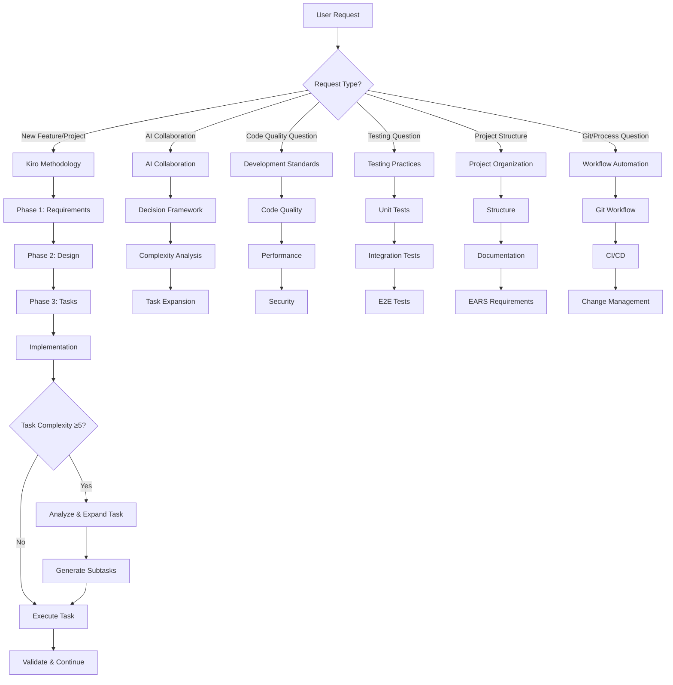

# Kiro AI Rules - Complete System

## Overview
This folder contains the complete, optimized Kiro AI rule system. These 6 files replace the original 18 files while preserving all valuable content and adding advanced task management capabilities.

## Rule Files (Load Order)
1. **kiro-methodology.mdc** - Core three-phase methodology and communication style
2. **ai-collaboration.mdc** - Decision frameworks, prompting, and complexity analysis
3. **development-standards.mdc** - Code quality, performance, security, tech stack
4. **project-organization.mdc** - Project structure, documentation, EARS requirements
5. **testing-practices.mdc** - Comprehensive testing standards
6. **workflow-automation.mdc** - Git, CI/CD, change management

## Workflow Decision Tree

## Communication Style (Always Apply)
- **Listen → Understand → Act**: Direct, action-oriented responses
- **Show, Don't Tell**: Demonstrate understanding through deliverables
- **Strategic Validation**: Simple approval questions at key decision points
- **No Verbose Explanations**: Jump straight to execution

## Quick Reference

### For New Features
1. Start with **kiro-methodology.mdc** - three-phase approach
2. Use **ai-collaboration.mdc** for decision-making and complexity analysis
3. Reference **development-standards.mdc** for implementation quality
4. Apply **testing-practices.mdc** for validation

### For Code Quality
1. **development-standards.mdc** - primary reference
2. **testing-practices.mdc** - validation approach
3. **workflow-automation.mdc** - process integration

### For Project Setup
1. **project-organization.mdc** - structure and documentation
2. **development-standards.mdc** - technical standards
3. **workflow-automation.mdc** - process setup

### For Complex Tasks
1. **ai-collaboration.mdc** - complexity analysis (1-10 scale)
2. **kiro-methodology.mdc** - task expansion and subtask management
3. **testing-practices.mdc** - validation strategies

## Integration Points
- All files work together as a cohesive system
- Cross-references are maintained between related concepts
- Consistent terminology and patterns throughout
- No conflicting guidance or redundant information

This system provides complete coverage of development practices while maintaining clarity, efficiency, and actionable guidance for AI agents.